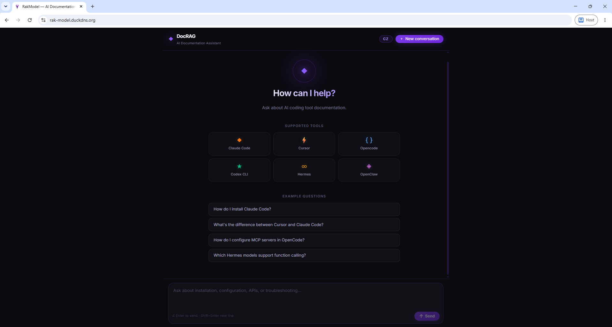

# RakModel — AI Documentation RAG Chatbot

> A production-deployed Retrieval-Augmented Generation chatbot that answers precise technical questions about six AI coding tools — from a single, unified interface.

**Live demo:** [https://rak-model.duckdns.org](https://rak-model.duckdns.org)


---



---

## Overview

RakModel answers developer questions like:

- *"Jak nakonfiguruji MCP servery v OpenCode?"* — in Czech, no translation needed by the user
- *"What's the difference between Cursor Agent and Claude Code's agent mode?"*
- *"Which Hermes models support structured JSON output and function calling?"*

It covers the official documentation of six AI coding assistants: **Claude Code**, **Cursor**, **Opencode (sst/opencode)**, **OpenAI Codex CLI**, **Hermes (Nous Research)**, and **OpenClaw**.

The system goes beyond simple vector search: it classifies intent, detects the target provider from the query, rewrites Czech queries into English for embedding, fuses BM25 and dense retrieval with Reciprocal Rank Fusion, reranks with an NVIDIA cross-encoder, generates answers via Claude Sonnet, and falls back to live Tavily web search when the corpus has no answer. Multi-turn sessions preserve conversational context so follow-up questions resolve correctly.

---

## Architecture

```
User query (Czech or English)
         │
         ▼
┌─────────────────────┐
│   Query Classifier   │  keyword → provider / query-type labels
└─────────┬───────────┘
          │
          ▼ (if Czech diacritics detected or follow-up turn)
┌─────────────────────┐
│   Query Rewriter     │  Claude: translate + contextualise follow-ups
└─────────┬───────────┘
          │
          ▼
┌──────────────────────────────────────────────────────────┐
│                  Hybrid Retrieval                         │
│                                                          │
│  ┌─────────────┐        ┌──────────────────┐            │
│  │  BM25/TF-IDF│        │  Qdrant (dense)  │            │
│  │  rank_bm25  │        │  text-embedding  │            │
│  │  + filter   │        │  -3-small 1536d  │            │
│  └──────┬──────┘        └────────┬─────────┘            │
│         └──────────┬─────────────┘                       │
│                    ▼                                      │
│           RRF Fusion  (k=60)                             │
│           max 2 chunks / provider                        │
└───────────────────┬──────────────────────────────────────┘
                    │
                    ▼
┌──────────────────────────────┐
│  Cross-Encoder Reranker       │  NVIDIA llama-nemotron-rerank-1b-v2
│  min_score threshold = 0.3    │  (fallback: BAAI/bge-reranker-v2-m3)
└──────────────┬───────────────┘
               │
               ▼
        Route Decision
       ┌───────┴───────┐
       │               │
  docs found      no docs / out-of-scope
       │               │
       ▼               ▼
 Claude Sonnet    Tavily Web Search
 4.6 (streaming)  → Claude Sonnet 4.6
       │               │
       └──────┬────────┘
              ▼
     SSE stream → SvelteKit UI
```

---

## Key Features

- **Hybrid retrieval with RRF fusion** — BM25 keyword search and Qdrant dense vector search run in parallel; Reciprocal Rank Fusion (k=60) combines their ranked lists, capping at 2 chunks per provider to preserve result diversity across the six-tool corpus.

- **NVIDIA cross-encoder reranking** — Retrieved candidates are re-scored by `nvidia/llama-nemotron-rerank-1b-v2` via NVIDIA's hosted API. A minimum score threshold of 0.3 gates out irrelevant chunks before they reach the LLM.

- **Cross-language support** — Czech queries are detected by the presence of Czech diacritics and transparently translated into natural English before embedding, so users can ask in their native language against an English-only documentation corpus.

- **Context-aware query rewriting** — Follow-up questions like *"A na Windows?"* that omit their subject are rewritten using the previous turn's query before retrieval, preventing silent context loss on multi-turn conversations.

- **Multi-turn sessions** — Each conversation has a session ID with TTL + LRU eviction. The previous query and last strong provider classification are forwarded to the chain on every turn so provider context is inherited automatically.

- **Intelligent routing** — Eight route strategies (`identity_direct`, `comparison_direct`, `unsupported_direct`, `clarification_direct`, `docs_rag`, `soft_guidance_direct`, `fallback_no_answer`, `web_search`) are selected based on query classification and retrieval confidence. Deterministic routes bypass the LLM entirely.

- **Tavily web search fallback** — When the corpus returns no confident answer (`fallback_no_answer` or `unsupported_direct`), the system queries Tavily and answers from live web results with a dedicated system prompt.

- **Route-aware response caching** — Answers are cached in-memory (optionally Redis) with per-route TTLs: 5 min for generic LLM, 30 min for RAG results, up to 24 h for identity queries. Web search results are never cached.

- **SSE streaming** — The `/chat/stream` endpoint streams tokens as Server-Sent Events. The SvelteKit frontend bypasses Svelte's reactive scheduler and writes directly to the DOM via `textContent` for true incremental display.

- **Evaluation framework** — 60 hand-crafted benchmark queries (10 per provider) with four automated metrics, runnable against a live API with a single script.

---

## Tech Stack

| Layer | Technology |
|---|---|
| Backend | FastAPI 0.111, Python 3.12, Uvicorn |
| Frontend | SvelteKit 2.x, Svelte 5 (runes mode), TypeScript, Vite 8 |
| Retrieval — sparse | rank-bm25 (BM25Okapi) |
| Retrieval — dense | Qdrant 1.9, OpenAI `text-embedding-3-small` (1536-dim) |
| Reranker | NVIDIA `llama-nemotron-rerank-1b-v2` API / `BAAI/bge-reranker-v2-m3` local |
| Generation | Anthropic Claude Sonnet 4.6 (`claude-sonnet-4-6`) |
| Web fallback | Tavily Search API |
| Session storage | In-memory (TTL + LRU) / Redis (optional) |
| Ingestion | Playwright + httpx scrapers per provider |
| Deployment | Hetzner VPS, nginx, systemd, Let's Encrypt |

---

## Evaluation Results

Benchmark: 60 queries, 10 per provider, run against the production API.

| Metric | Score |
|---|---|
| Provider hit rate | **100.0 %** |
| Route match rate | **100.0 %** |
| Source hit rate | **96.7 %** |
| Has-answer rate | **100.0 %** |
| Average latency | 13 202 ms |

Two `source_miss` results (correct answer still returned, only source URL attribution missed):

- `hermes_05_mcp_tools` — Hermes MCP-style tool integration query
- `hermes_06_permissions_safety` — Hermes tool-call safety considerations query

---

## Supported Providers

| Provider | Tool | Documentation source |
|---|---|---|
| Anthropic | **Claude Code** | docs.anthropic.com/claude-code |
| Cursor | **Cursor** | cursor.com/docs |
| SST / Opencode | **Opencode** | opencode.ai/docs + github.com/sst/opencode |
| OpenAI | **Codex CLI** | platform.openai.com/docs |
| Nous Research | **Hermes** | huggingface.co/NousResearch + GitHub model cards |
| OpenClaw | **OpenClaw** | docs.openclaw.ai |

---

## Project Structure

```
docrag/
├── config.py                    # All settings via pydantic-settings / .env
├── requirements.txt
│
├── src/
│   ├── api/
│   │   └── main.py              # FastAPI app, session pool, /chat /chat/stream /health
│   ├── generation/
│   │   ├── chain.py             # DocsRAGChain — routing, retrieval, LLM, caching
│   │   ├── prompts.py           # System prompt, query rewrite prompts
│   │   ├── cache.py             # ResponseCache with per-route TTLs
│   │   └── constants.py         # RouteStrategy enum
│   ├── retrieval/
│   │   ├── retriever.py         # DocsRetriever — pipeline orchestrator
│   │   ├── hybrid.py            # BM25 + Qdrant + RRF fusion
│   │   ├── query_classifier.py  # classify_query() → QueryProfile
│   │   ├── reranker.py          # CrossEncoderReranker (NVIDIA or local)
│   │   └── web_search.py        # TavilySearcher async wrapper
│   ├── ingestion/
│   │   ├── base_scraper.py      # BaseScraper with rate-limiting + HTML cache
│   │   ├── scrapers/            # One scraper per provider (6 total)
│   │   ├── chunker.py           # doc_type-aware chunking strategy
│   │   ├── embedder.py          # Batch embedding via OpenAI API
│   │   └── ingest.py            # Orchestrates scrape → chunk → embed → upsert
│   └── storage/
│       ├── memory.py            # InMemoryCacheBackend + InMemorySessionBackend
│       └── redis_impl.py        # Optional Redis backends
│
├── frontend/                    # SvelteKit 2 / Svelte 5 runes UI
│   └── src/
│       ├── lib/api.ts           # Typed fetch wrapper + SSE reader
│       └── routes/+page.svelte  # Chat UI — glassmorphism, CS/EN toggle, markdown
│
├── scripts/
│   ├── serve.py                 # Start backend locally
│   ├── ingest_all.py            # Run all provider scrapers
│   └── run_evaluation.py        # Evaluation benchmark runner
│
├── tests/
│   ├── evaluation_queries.json  # 60 benchmark queries with expected metadata
│   └── evaluation_results.json  # Latest benchmark output
│
└── deploy/
    ├── nginx/                   # nginx site configuration
    ├── systemd/                 # systemd service units
    └── scripts/                 # Deployment helper scripts
```

---

## Getting Started

### Prerequisites

- Python 3.12+
- Node.js 20+
- Docker (for Qdrant)
- API keys: `ANTHROPIC_API_KEY`, `OPENAI_API_KEY`, `NVIDIA_API_KEY` (reranker), `TAVILY_API_KEY` (web fallback, optional)

### Backend

```bash
# 1. Clone and create virtual environment
git clone https://github.com/Jessaka/docrag.git
cd docrag
python -m venv .venv && source .venv/bin/activate
pip install -r requirements.txt

# 2. Configure environment
cp .env.example .env
# Edit .env — fill in at minimum: ANTHROPIC_API_KEY, OPENAI_API_KEY

# 3. Start Qdrant
docker run -d -p 6333:6333 qdrant/qdrant

# 4. Run ingestion
#    Scrapes all 6 providers, embeds chunks, upserts to Qdrant, builds BM25 index
PYTHONPATH=. python scripts/ingest_all.py

# 5. Start the API server
PYTHONPATH=. python scripts/serve.py
# Listening on http://localhost:8000
```

### Frontend

```bash
cd frontend
npm install
npm run dev
# Available at http://localhost:5173
```

### Production build

```bash
cd frontend
VITE_API_BASE_URL=https://your-domain.com npm run build
# Outputs adapter-node bundle to frontend/build/
node frontend/build/index.js
```

---

## API Reference

### `POST /chat`

Synchronous Q&A — returns the complete answer in one response.

**Request**
```json
{
  "query": "How do I install Claude Code?",
  "session_id": "optional-existing-session-uuid"
}
```

**Response**
```json
{
  "session_id": "abc-123",
  "answer": "You can install Claude Code via npm:\n\n```\nnpm install -g @anthropic-ai/claude-code\n```\n...",
  "route": "docs_rag",
  "cached": false,
  "sources": [
    {
      "title": "Installation — Claude Code",
      "url": "https://docs.anthropic.com/claude-code/installation",
      "provider": "anthropic",
      "tool_name": "claude-code",
      "doc_type": "getting_started",
      "score": 0.94
    }
  ],
  "query_profile": {
    "query_type": "installation",
    "providers": ["anthropic"],
    "tools": ["claude-code"],
    "is_comparison": false
  }
}
```

### `POST /chat/stream`

Streaming Q&A via Server-Sent Events. Event order: `session` → `meta` → `token` (×N) → `done`.

```bash
curl -X POST http://localhost:8000/chat/stream \
  -H "Content-Type: application/json" \
  -d '{"query": "Jak nainstaluji Claude Code?"}' \
  --no-buffer
```

```
data: {"type":"session","session_id":"abc-123"}

data: {"type":"meta","route":"docs_rag","cached":false,"sources":[...]}

data: {"type":"token","text":"Claude Code nainstalujete pomocí npm:\n\n```\n"}
data: {"type":"token","text":"npm install -g @anthropic-ai/claude-code\n```\n"}
...
data: {"type":"done","response":{...full response object...}}
```

### `GET /health`

```json
{
  "status": "ok",
  "qdrant": "ok",
  "bm25_index": "loaded",
  "session_count": 3,
  "cache_stats": {"hits": 14, "misses": 31}
}
```

---

## Evaluation Methodology

```bash
# Run against a live backend
PYTHONPATH=. python scripts/run_evaluation.py --base-url http://localhost:8000
```

`tests/evaluation_queries.json` defines 60 queries. Each entry includes:

```json
{
  "id": "cursor_03_hooks",
  "query": "Does Cursor support pre/post-action hooks?",
  "expected_provider": "cursor",
  "expected_route": "docs_rag",
  "expected_source_urls": ["https://cursor.com/docs/context/rules"],
  "notes": ""
}
```

**Four metrics evaluated per query:**

| Metric | Pass condition |
|---|---|
| `provider_hit` | At least one returned source has the expected `provider` field |
| `route_match` | Returned `route` equals `expected_route` |
| `source_hit` | A returned source URL exactly matches an expected URL, or shares hostname with one while matching the expected provider |
| `has_answer` | Answer is non-empty and does not match known "no answer" prefixes |

Results are written to `tests/evaluation_results.json` with per-query breakdowns and an aggregate summary.

---

## Deployment

Deployed on a **Hetzner VPS** (Ubuntu 22.04):

| Component | Details |
|---|---|
| Backend | systemd service — Uvicorn on `127.0.0.1:8000` |
| Frontend | systemd service — SvelteKit Node adapter on `127.0.0.1:3000` |
| Reverse proxy | nginx on port 443 with Let's Encrypt TLS |
| Vector DB | Qdrant in Docker on `localhost:6333` (not exposed) |

Live at: **[https://rak-model.duckdns.org](https://rak-model.duckdns.org)**

---

## License

No `LICENSE` file is currently present in this repository. **MIT license is recommended.** To add it:

```bash
curl -o LICENSE https://opensource.org/licenses/MIT
# (or create manually with year + author name)
```

---

## Author

**Jessaka** — [github.com/Jessaka](https://github.com/Jessaka)
